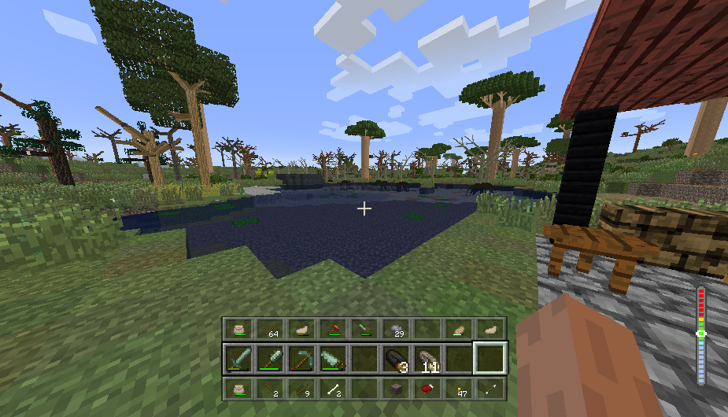
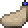
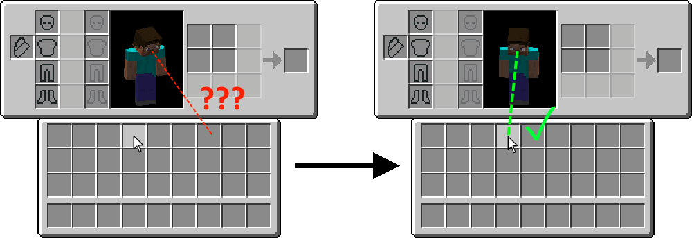
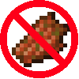
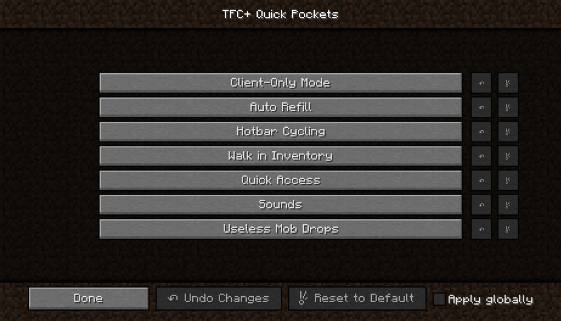

# TFC+ Quick Pockets

The TFC+ Addon that tries to simplify and streamline inventory management - one unnecessary click at a time. So that you can focus on playing this incredible game instead of being bogged down by inventory screens.

If you find inventory management tedious, this is for you!

## Features

### Hotbar Cycling

TFC adds so many great new tools to minecraft, and this is absolutely awesome! However it also means that your hotbar is constantly filled with tools that you have to swap between very often, which brings your momentary experience to a halt.

This mod tackles this issue by allowing you to swap items in your hotbar without ever having to go to your inventory screen. Simply press and hold <kbd>ALT</kbd> and a preview window will appear showing you whats in the inventory slots above, and below your hotbar.

<p align="center">
  
</p>  

While holding <kbd>ALT</kbd> you can then <kbd>SCROLL UP</kbd> or <kbd>SCROLL DOWN</kbd> to swap the items in your hotbar, giving you quick and convenient access to your whole inventory.

### Auto-Refill

You're chopping a tree, and your axe suddenly breaks. Aw snap - well thankfully you've come prepared! You have another axe in your inventory just for situations like this. But now you have to open up the inventory menu and swap it into your hand - completely breaking your tree-cutting flow. Not anymore.

With the auto-refill feature enabled, whenever you break a tool, a new one will be placed into your hand - provided you have a backup in your inventory to begin with. This also works for weapons, food, drinks, building blocks, as well as other items like stone flakes, flowers, etc.

### Quick Bag Access

Moving items to and from vessels and leather bags can be very tedious, as you first have to open up your inventory, drop the first bag in your hotbar, close the menu, right click on the bag from your hotbar, move the items from the bag to your inventory, then open up your inventory again, move the second bag to the hotbar, right click on the second bag...

With this mod, you can simply <kbd>RIGHT CLICK</kbd> on any bag from any inventory screen and the bag will be placed in your hotbar and open right there on the spot. This allows you to swap items in your bag without ever leaving your inventory screen.

### Quick Tool Swapping

You want the right tool for the job, but it's not in your hotbar! It's god knows where in your inventory, oh brother. This mod adds hotkeys that allow you to instantly cycle through the tools you want without you ever having to look through your inventory. There's hotkeys for axes, saws, pickaxes, chisels, ...

These hotkeys are not bound to anything by default, but you can bind them yourself in the `Controls` section of the Options menu, under the `Inventory` category. 

### Walk in Inventory

Have you ever found it kind of strange how your character cannot move at all while your inventory screen is open. Well if this ever bothered you before, this mod allows you to run and jump inside of your inventory screen when you hold the <kbd>SPRINT</kbd> key. Be free.

Note that it wouldn't make much sense to allow the player to move around while inspecting a chest's inventory, so this feature only works for the player inventory, as well as for container inventories for containers that you can carry around with you, like the small vessel and the leather bag.

### Additional Sounds

Minecraft 1.7.10 is oddly quiet, especially compared to the newer versions. There are no bucket sounds, no weapon sounds, not even a chest closing sound. This addon adds these newer sounds back in, along with additional TFC+ specific sounds. 

For a full list of added sounds, as well as the volume sliders that control them, expand the list below. Most of these sounds can be toggled on or off on an individual basis from the config menu.

<details>
  <summary>Click to expand.</summary>
 
|sound|variants|when it plays|volume slider|source|
|:--- |:------:|:------------|:-----------:|:----:|
|attack-axe|[1](https://raw.githubusercontent.com/blat-blatnik/TFC-Quick-Pockets/master/src/main/resources/assets/tfcquickpockets/sounds/attack-axe-1.ogg) [2](https://raw.githubusercontent.com/blat-blatnik/TFC-Quick-Pockets/master/src/main/resources/assets/tfcquickpockets/sounds/attack-axe-2.ogg) [3](https://raw.githubusercontent.com/blat-blatnik/TFC-Quick-Pockets/master/src/main/resources/assets/tfcquickpockets/sounds/attack-axe-3.ogg)|when dealing damage with an axe|`Players`|[Minecraft](https://minecraft.gamepedia.com/Sword#Sounds)|
|attack-mace|[1](https://raw.githubusercontent.com/blat-blatnik/TFC-Quick-Pockets/master/src/main/resources/assets/tfcquickpockets/sounds/attack-mace-1.ogg) [2](https://raw.githubusercontent.com/blat-blatnik/TFC-Quick-Pockets/master/src/main/resources/assets/tfcquickpockets/sounds/attack-mace-2.ogg) [3](https://raw.githubusercontent.com/blat-blatnik/TFC-Quick-Pockets/master/src/main/resources/assets/tfcquickpockets/sounds/attack-mace-3.ogg) [4](https://raw.githubusercontent.com/blat-blatnik/TFC-Quick-Pockets/master/src/main/resources/assets/tfcquickpockets/sounds/attack-mace-4.ogg)|when dealing damage with a mace|`Players`|[Minecraft](https://minecraft.gamepedia.com/Sword#Sounds)|
|attack-sword|[1](https://raw.githubusercontent.com/blat-blatnik/TFC-Quick-Pockets/master/src/main/resources/assets/tfcquickpockets/sounds/attack-sword-1.ogg) [2](https://raw.githubusercontent.com/blat-blatnik/TFC-Quick-Pockets/master/src/main/resources/assets/tfcquickpockets/sounds/attack-sword-2.ogg) [3](https://raw.githubusercontent.com/blat-blatnik/TFC-Quick-Pockets/master/src/main/resources/assets/tfcquickpockets/sounds/attack-sword-3.ogg) [4](https://raw.githubusercontent.com/blat-blatnik/TFC-Quick-Pockets/master/src/main/resources/assets/tfcquickpockets/sounds/attack-sword-4.ogg) [5](https://raw.githubusercontent.com/blat-blatnik/TFC-Quick-Pockets/master/src/main/resources/assets/tfcquickpockets/sounds/attack-sword-5.ogg) [6](https://raw.githubusercontent.com/blat-blatnik/TFC-Quick-Pockets/master/src/main/resources/assets/tfcquickpockets/sounds/attack-sword-6.ogg) [7](https://raw.githubusercontent.com/blat-blatnik/TFC-Quick-Pockets/master/src/main/resources/assets/tfcquickpockets/sounds/attack-sword-7.ogg)|when dealing damage with a sword|`Players`|[Minecraft](https://minecraft.gamepedia.com/Sword#Sounds)|
|attack-strong|[1](https://raw.githubusercontent.com/blat-blatnik/TFC-Quick-Pockets/master/src/main/resources/assets/tfcquickpockets/sounds/attack-strong-1.ogg) [2](https://raw.githubusercontent.com/blat-blatnik/TFC-Quick-Pockets/master/src/main/resources/assets/tfcquickpockets/sounds/attack-strong-2.ogg) [3](https://raw.githubusercontent.com/blat-blatnik/TFC-Quick-Pockets/master/src/main/resources/assets/tfcquickpockets/sounds/attack-strong-3.ogg) [4](https://raw.githubusercontent.com/blat-blatnik/TFC-Quick-Pockets/master/src/main/resources/assets/tfcquickpockets/sounds/attack-strong-4.ogg) [5](https://raw.githubusercontent.com/blat-blatnik/TFC-Quick-Pockets/master/src/main/resources/assets/tfcquickpockets/sounds/attack-strong-5.ogg)|when dealing damage with a tool|`Players`|[Minecraft](https://minecraft.gamepedia.com/Sword#Sounds)|
|attack-weak|[1](https://raw.githubusercontent.com/blat-blatnik/TFC-Quick-Pockets/master/src/main/resources/assets/tfcquickpockets/sounds/attack-weak-1.ogg) [2](https://raw.githubusercontent.com/blat-blatnik/TFC-Quick-Pockets/master/src/main/resources/assets/tfcquickpockets/sounds/attack-weak-2.ogg) [3](https://raw.githubusercontent.com/blat-blatnik/TFC-Quick-Pockets/master/src/main/resources/assets/tfcquickpockets/sounds/attack-weak-3.ogg) [4](https://raw.githubusercontent.com/blat-blatnik/TFC-Quick-Pockets/master/src/main/resources/assets/tfcquickpockets/sounds/attack-weak-4.ogg)|when dealing damage with anything except the above|`Players`|[Minecraft](https://minecraft.gamepedia.com/Sword#Sounds)|
|bag-open|[1](https://raw.githubusercontent.com/blat-blatnik/TFC-Quick-Pockets/master/src/main/resources/assets/tfcquickpockets/sounds/bag-open-1.ogg) [2](https://raw.githubusercontent.com/blat-blatnik/TFC-Quick-Pockets/master/src/main/resources/assets/tfcquickpockets/sounds/bag-open-2.ogg)|when changing hotbar slots, opening player inventory, or cycling through hotbar rows|`Players`|[MAtmos](https://www.curseforge.com/minecraft/mc-mods/matmos)|
|barrel-seal|[1](https://raw.githubusercontent.com/blat-blatnik/TFC-Quick-Pockets/master/src/main/resources/assets/tfcquickpockets/sounds/barrel-seal.ogg)|when sealing a barrel|`Blocks`|[Minecraft](https://minecraft.gamepedia.com/Barrel#Sounds)|
|barrel-unseal|[1](https://raw.githubusercontent.com/blat-blatnik/TFC-Quick-Pockets/master/src/main/resources/assets/tfcquickpockets/sounds/barrel-unseal-1.ogg) [2](https://raw.githubusercontent.com/blat-blatnik/TFC-Quick-Pockets/master/src/main/resources/assets/tfcquickpockets/sounds/barrel-unseal-2.ogg)|when unsealing a barrel|`Blocks`|[Minecraft](https://minecraft.gamepedia.com/Barrel#Sounds)|
|beehive-close|[1](https://raw.githubusercontent.com/blat-blatnik/TFC-Quick-Pockets/master/src/main/resources/assets/tfcquickpockets/sounds/beehive-close.ogg)|when closing a beehive's inventory|`Blocks`|[Minecraft](https://minecraft.gamepedia.com/Beehive#Sounds)|
|beehive-drip|[1](https://raw.githubusercontent.com/blat-blatnik/TFC-Quick-Pockets/master/src/main/resources/assets/tfcquickpockets/sounds/beehive-drip-1.ogg) [2](https://raw.githubusercontent.com/blat-blatnik/TFC-Quick-Pockets/master/src/main/resources/assets/tfcquickpockets/sounds/beehive-drip-2.ogg) [3](https://raw.githubusercontent.com/blat-blatnik/TFC-Quick-Pockets/master/src/main/resources/assets/tfcquickpockets/sounds/beehive-drip-3.ogg) [4](https://raw.githubusercontent.com/blat-blatnik/TFC-Quick-Pockets/master/src/main/resources/assets/tfcquickpockets/sounds/beehive-drip-4.ogg) [5](https://raw.githubusercontent.com/blat-blatnik/TFC-Quick-Pockets/master/src/main/resources/assets/tfcquickpockets/sounds/beehive-drip-5.ogg) [6](https://raw.githubusercontent.com/blat-blatnik/TFC-Quick-Pockets/master/src/main/resources/assets/tfcquickpockets/sounds/beehive-drip-6.ogg)|when taking honey from a beehive|`Blocks`|[Minecraft](https://minecraft.gamepedia.com/Beehive#Sounds)|
|beehive-open|[1](https://raw.githubusercontent.com/blat-blatnik/TFC-Quick-Pockets/master/src/main/resources/assets/tfcquickpockets/sounds/beehive-open.ogg)|when opening a beehive's inventory|`Blocks`|[Minecraft](https://minecraft.gamepedia.com/Beehive#Sounds)|
|bow-nock|[1](https://raw.githubusercontent.com/blat-blatnik/TFC-Quick-Pockets/master/src/main/resources/assets/tfcquickpockets/sounds/bow-nock.ogg)|when charging the bow|`Players`|[MAtmos](https://www.curseforge.com/minecraft/mc-mods/matmos)|
|bucket-empty|[1](https://raw.githubusercontent.com/blat-blatnik/TFC-Quick-Pockets/master/src/main/resources/assets/tfcquickpockets/sounds/bucket-empty-1.ogg) [2](https://raw.githubusercontent.com/blat-blatnik/TFC-Quick-Pockets/master/src/main/resources/assets/tfcquickpockets/sounds/bucket-empty-2.ogg) [3](https://raw.githubusercontent.com/blat-blatnik/TFC-Quick-Pockets/master/src/main/resources/assets/tfcquickpockets/sounds/bucket-empty-3.ogg)|when emptying a bucket|`Blocks`|[Minecraft](https://minecraft.gamepedia.com/Bucket#Sounds)|
|bucket-empty-viscous|[1](https://raw.githubusercontent.com/blat-blatnik/TFC-Quick-Pockets/master/src/main/resources/assets/tfcquickpockets/sounds/bucket-empty-viscous-1.ogg) [2](https://raw.githubusercontent.com/blat-blatnik/TFC-Quick-Pockets/master/src/main/resources/assets/tfcquickpockets/sounds/bucket-empty-viscous-2.ogg) [3](https://raw.githubusercontent.com/blat-blatnik/TFC-Quick-Pockets/master/src/main/resources/assets/tfcquickpockets/sounds/bucket-empty-viscous-3.ogg)|when emptying a bucket with a viscous fluid such as pitch|`Blocks`|[Minecraft](https://minecraft.gamepedia.com/Bucket#Sounds)|
|bucket-fill|[1](https://raw.githubusercontent.com/blat-blatnik/TFC-Quick-Pockets/master/src/main/resources/assets/tfcquickpockets/sounds/bucket-fill-1.ogg) [2](https://raw.githubusercontent.com/blat-blatnik/TFC-Quick-Pockets/master/src/main/resources/assets/tfcquickpockets/sounds/bucket-fill-2.ogg) [3](https://raw.githubusercontent.com/blat-blatnik/TFC-Quick-Pockets/master/src/main/resources/assets/tfcquickpockets/sounds/bucket-fill-3.ogg)|when filling a bucket|`Blocks`|[Minecraft](https://minecraft.gamepedia.com/Bucket#Sounds)|
|bucket-fill-viscous|[1](https://raw.githubusercontent.com/blat-blatnik/TFC-Quick-Pockets/master/src/main/resources/assets/tfcquickpockets/sounds/bucket-fill-viscous-1.ogg) [2](https://raw.githubusercontent.com/blat-blatnik/TFC-Quick-Pockets/master/src/main/resources/assets/tfcquickpockets/sounds/bucket-fill-viscous-2.ogg) [3](https://raw.githubusercontent.com/blat-blatnik/TFC-Quick-Pockets/master/src/main/resources/assets/tfcquickpockets/sounds/bucket-fill-viscous-3.ogg)|when filling a bucket with a viscous fluid such as pitch|`Blocks`|[Minecraft](https://minecraft.gamepedia.com/Bucket#Sounds)|
|chest-close|[1](https://raw.githubusercontent.com/blat-blatnik/TFC-Quick-Pockets/master/src/main/resources/assets/tfcquickpockets/sounds/chest-close-1.ogg) [2](https://raw.githubusercontent.com/blat-blatnik/TFC-Quick-Pockets/master/src/main/resources/assets/tfcquickpockets/sounds/chest-close-2.ogg) [3](https://raw.githubusercontent.com/blat-blatnik/TFC-Quick-Pockets/master/src/main/resources/assets/tfcquickpockets/sounds/chest-close-3.ogg)|when closing a chest|`Blocks`|[Minecraft](https://minecraft.gamepedia.com/Chest#Sounds)|
|cow-milk|[1](https://raw.githubusercontent.com/blat-blatnik/TFC-Quick-Pockets/master/src/main/resources/assets/tfcquickpockets/sounds/cow-milk-1.ogg) [2](https://raw.githubusercontent.com/blat-blatnik/TFC-Quick-Pockets/master/src/main/resources/assets/tfcquickpockets/sounds/cow-milk-2.ogg) [3](https://raw.githubusercontent.com/blat-blatnik/TFC-Quick-Pockets/master/src/main/resources/assets/tfcquickpockets/sounds/cow-milk-3.ogg)|when milking a cow|`Blocks`|[Minecraft](https://minecraft.gamepedia.com/Bucket#Sounds)|
|fire-crackle|[1](https://raw.githubusercontent.com/blat-blatnik/TFC-Quick-Pockets/master/src/main/resources/assets/tfcquickpockets/sounds/fire-crackle-1.ogg) [2](https://raw.githubusercontent.com/blat-blatnik/TFC-Quick-Pockets/master/src/main/resources/assets/tfcquickpockets/sounds/fire-crackle-2.ogg) [3](https://raw.githubusercontent.com/blat-blatnik/TFC-Quick-Pockets/master/src/main/resources/assets/tfcquickpockets/sounds/fire-crackle-3.ogg) [4](https://raw.githubusercontent.com/blat-blatnik/TFC-Quick-Pockets/master/src/main/resources/assets/tfcquickpockets/sounds/fire-crackle-4.ogg) [5](https://raw.githubusercontent.com/blat-blatnik/TFC-Quick-Pockets/master/src/main/resources/assets/tfcquickpockets/sounds/fire-crackle-5.ogg) [6](https://raw.githubusercontent.com/blat-blatnik/TFC-Quick-Pockets/master/src/main/resources/assets/tfcquickpockets/sounds/fire-crackle-6.ogg)|when near a lit fire pit|`Blocks`|[Minecraft](https://minecraft.gamepedia.com/Campfire#Sounds)|
|fluid-empty|[1](https://raw.githubusercontent.com/blat-blatnik/TFC-Quick-Pockets/master/src/main/resources/assets/tfcquickpockets/sounds/fluid-empty-1.ogg) [2](https://raw.githubusercontent.com/blat-blatnik/TFC-Quick-Pockets/master/src/main/resources/assets/tfcquickpockets/sounds/fluid-empty-2.ogg)|when emptying a barrel|`Blocks`|[Minecraft](https://minecraft.gamepedia.com/Bucket#Sounds)|
|fluid-empty-viscous|[1](https://raw.githubusercontent.com/blat-blatnik/TFC-Quick-Pockets/master/src/main/resources/assets/tfcquickpockets/sounds/fluid-empty-viscous.ogg)|when emptying a barrel full of viscous fluid such as pitch|`Blocks`|[Minecraft](https://minecraft.gamepedia.com/Bucket#Sounds)|
|fluid-soak|[1](https://raw.githubusercontent.com/blat-blatnik/TFC-Quick-Pockets/master/src/main/resources/assets/tfcquickpockets/sounds/fluid-soak-1.ogg) [2](https://raw.githubusercontent.com/blat-blatnik/TFC-Quick-Pockets/master/src/main/resources/assets/tfcquickpockets/sounds/fluid-soak-2.ogg) [3](https://raw.githubusercontent.com/blat-blatnik/TFC-Quick-Pockets/master/src/main/resources/assets/tfcquickpockets/sounds/fluid-soak-3.ogg)|when placing an item in a barrel full of liquid|`Blocks`|[Minecraft](https://minecraft.gamepedia.com/Bucket#Sounds)|
|fluid-soak-viscous|[1](https://raw.githubusercontent.com/blat-blatnik/TFC-Quick-Pockets/master/src/main/resources/assets/tfcquickpockets/sounds/fluid-soak-viscous-1.ogg) [2](https://raw.githubusercontent.com/blat-blatnik/TFC-Quick-Pockets/master/src/main/resources/assets/tfcquickpockets/sounds/fluid-soak-viscous-2.ogg)|when placing an item in a barrel full of a viscous liquid|`Blocks`|[Minecraft](https://minecraft.gamepedia.com/Bucket#Sounds)|
|fluid-unsoak|[1](https://raw.githubusercontent.com/blat-blatnik/TFC-Quick-Pockets/master/src/main/resources/assets/tfcquickpockets/sounds/fluid-unsoak-1.ogg) [2](https://raw.githubusercontent.com/blat-blatnik/TFC-Quick-Pockets/master/src/main/resources/assets/tfcquickpockets/sounds/fluid-unsoak-2.ogg) [3](https://raw.githubusercontent.com/blat-blatnik/TFC-Quick-Pockets/master/src/main/resources/assets/tfcquickpockets/sounds/fluid-unsoak-3.ogg)|when taking an item from a barrel full of liquid|`Blocks`|[Minecraft](https://minecraft.gamepedia.com/Bucket#Sounds)|
|fluid-unsoak-viscous|[1](https://raw.githubusercontent.com/blat-blatnik/TFC-Quick-Pockets/master/src/main/resources/assets/tfcquickpockets/sounds/fluid-unsoak-viscous-1.ogg) [2](https://raw.githubusercontent.com/blat-blatnik/TFC-Quick-Pockets/master/src/main/resources/assets/tfcquickpockets/sounds/fluid-unsoak-viscous-2.ogg) [3](https://raw.githubusercontent.com/blat-blatnik/TFC-Quick-Pockets/master/src/main/resources/assets/tfcquickpockets/sounds/fluid-unsoak-viscous-3.ogg)|when taking an item from a barrel full of a viscous liquid|`Blocks`|[Minecraft](https://minecraft.gamepedia.com/Bucket#Sounds)|
|large-vessel-seal|[1](https://raw.githubusercontent.com/blat-blatnik/TFC-Quick-Pockets/master/src/main/resources/assets/tfcquickpockets/sounds/large-vessel-seal.ogg)|when sealing a large vessel|`Blocks`|[freesound.org](https://freesound.org/people/ahill86/sounds/206145/)|
|large-vessel-unseal|[1](https://raw.githubusercontent.com/blat-blatnik/TFC-Quick-Pockets/master/src/main/resources/assets/tfcquickpockets/sounds/large-vessel-unseal.ogg)|when unsealing a large vessel|`Blocks`|[freesound.org](https://freesound.org/people/ahill86/sounds/206145/)|
|leash-break|[1](https://raw.githubusercontent.com/blat-blatnik/TFC-Quick-Pockets/master/src/main/resources/assets/tfcquickpockets/sounds/leash-break-1.ogg) [2](https://raw.githubusercontent.com/blat-blatnik/TFC-Quick-Pockets/master/src/main/resources/assets/tfcquickpockets/sounds/leash-break-2.ogg) [3](https://raw.githubusercontent.com/blat-blatnik/TFC-Quick-Pockets/master/src/main/resources/assets/tfcquickpockets/sounds/leash-break-3.ogg)|when a lead/rope breaks|`Blocks`|[Minecraft](https://minecraft.gamepedia.com/Lead#Sounds)|
|leash-place|[1](https://raw.githubusercontent.com/blat-blatnik/TFC-Quick-Pockets/master/src/main/resources/assets/tfcquickpockets/sounds/leash-place-1.ogg) [2](https://raw.githubusercontent.com/blat-blatnik/TFC-Quick-Pockets/master/src/main/resources/assets/tfcquickpockets/sounds/leash-place-2.ogg) [3](https://raw.githubusercontent.com/blat-blatnik/TFC-Quick-Pockets/master/src/main/resources/assets/tfcquickpockets/sounds/leash-place-3.ogg)|when attaching a lead/rope to a fence|`Blocks`|[Minecraft](https://minecraft.gamepedia.com/Lead#Sounds)|

</details>

_I do not take credit for making the sounds themselves. The credits for each sound are listed above._

### Waterskin Fix

<p align="left">
  
  
  These little guys are a blessing and a curse. On one hand they hold a lot more water than a clay jug and so you don't have to carry as many of them. On another hand, they are hyperactive little monsters! Every time you fill one up, or drink from it, they change inventory slots, ruining your perfectly organized inventory.
</p>

This mod adds a very hacky fix for this problem. It detects when a waterskin "hops" inventory slots and places it in the correct slot on the next game tick, saving you the trouble of doing it manually.

### Inventory Fixes

Apart from the core features, this mod also fixes a few small visual inconsistencies. Things that you probably won't notice for a while but that you can't stop noticing if you've seen them.

The player model in the inventory screen is supposed to be looking directly at your cursor - but they don't! They look slightly off to the side. This was fixed.

<details>
  <summary>Click to expand.</summary>
  <p align="center">
    
  </p>
</details>

The basket and large vessel inventory screens hava a small inconsistency on their left-most inventory slots. This has also been fixed.

<details>
  <summary>Click to expand.</summary>
  <p align="center">
    
  </p>
</details>

The textures of 9 chest variants were slighly incorrect leading to these chests noticeably flickering due to z-fighting. Baobab, ebony, fever, fruitwood, gingko, limba, mahogany, mangrove, and palm chest had this problem. This mod fixes this problem.

### No Useless Drops

<p align="left">
  
  
  
  Spider eyes and rotten flesh have absolutely no use in TFC+. Their only purpose is to bog down your inventory - well not anymore. This mod stops rotten flesh and spider eyes from spawning.
</p>

### Config Options

All of the above features are fully customizable. You can completely choose whatever combination of features works best for you. There configuration categories for each of the above features in the mod's `Config` menu. For features that require pressing keys, these keys can be bound through the key bindings menu, under the `Inventory` category.

<details>
  <summary>Click to expand.</summary>
  <p align="center">
    
  </p>
</details>

## Requirements

This mod is build as an addon for TerraFirmaCraft+, a minecraft mod which you can download [here](https://www.curseforge.com/minecraft/mc-mods/terrafirmacraftplus/files) if you haven't already. It was tested and working with TFC+ versions 0.84.1 -- 0.86.2, however it should also work with newer versions as long as they don't change the GUI too much.

The mod was build using Minecraft Forge 10.13.4.1558 for minecraft 1.7.10. Forge is required for running this mod, and you can download it [here](http://files.minecraftforge.net/maven/net/minecraftforge/forge/index_1.7.10.html) if you haven't already.

## Build from Source

Download the source and open a terminal in the folder containing the `gradlew` file. Run:

```bash
$ gradlew setupDecompWorkspace
```

This will take a while to complete. After it's done run:

```bash
$ gradlew build
```

After it has finished, the mod you built should be in the `./build/libs/` directory.

## Download and Install

Download the latest version [here](https://github.com/blat-blatnik/TFC-Quick-Pockets/releases). 

Put the downloaded `jar` file in your [`mods`](https://gaming.stackexchange.com/questions/151317/where-is-the-mod-folder) folder, right alongside TFC+. Tested and working with TFC+ 0.84.1 -- 0.86.2. 

All features of this addon that move items around in the inventory require server support to function. If you want to play with this addon on a server that does not have it installed, you need to enable "Client Only Mode" from the config menu. _If you do not do this you could crash the game, or the server itself._

**Note** This mod manipulates your inventory. This can sometimes result in items being duplicated, or lost when a severe bug is present. I try to fix critical things like this as soon as possible, and the mod has been tested somewhat thoroughly at this point, but some problems may still have slipped through the cracks. Only use this if you understand the risks. _**Back up** your beloved save games before using this mod_.

## Version History

<details>
  <summary>Click to expand.</summary>

|version|TFC+ versions|changes|
|:-----:|:-----------:|:------|
|[1.1.5](https://github.com/blat-blatnik/TFC-Quick-Pockets/releases/tag/v1.1.5)|0.84.1 - 0.86.2|• fixed raw grains stacking with cut grains when picked up|
|[1.1.4](https://github.com/blat-blatnik/TFC-Quick-Pockets/releases/tag/v1.1.4)|0.84.1 - 0.85.6|• fixed salads and sandwiches not being considered food and water jugs not being considered drinks|
|[1.1.3](https://github.com/blat-blatnik/TFC-Quick-Pockets/releases/tag/v1.1.3)|0.84.1 - 0.85.6|• fixed crash when certain keys were bound to mouse buttons|
|[1.1.2](https://github.com/blat-blatnik/TFC-Quick-Pockets/releases/tag/v1.1.2)|0.84.1 - 0.85.3|• added bloomery and blast furnace sounds<br>• fixed bug with bow sounds|
|[1.1.1](https://github.com/blat-blatnik/TFC-Quick-Pockets/releases/tag/v1.1.1)|0.84.1 - 0.85.3|• fixed some chests had textures that caused them to flicker<br>• various bug fixes|
|[1.1](https://github.com/blat-blatnik/TFC-Quick-Pockets/releases/tag/v1.1)|0.84.1 - 0.85.3|• added additional sounds<br>• food is now automatically stacked when picked up<br>• improved how auto-refill looks for replacement items<br>• added client-side only mode for playing on servers<br>• "remove dark filter in inventory" is now turned off by default|
|[1.0](https://github.com/blat-blatnik/TFC-Quick-Pockets/releases/tag/v1.0)|0.84.1 - 0.85.2|• fixed inconsistencies with large vessel and basket GUI|
|[beta 1.2.2](https://github.com/blat-blatnik/TFC-Quick-Pockets/releases/tag/v1.2.2-beta)|0.84.1 - 0.85.2|• improved how auto-refill looks for replacement items<br>• added config option to enable walk in inventory without the <kbd>SPRINT</kbd> key|
|[beta 1.2.1](https://github.com/blat-blatnik/TFC-Quick-Pockets/releases/tag/v1.2.1-beta)|0.84.1 - 0.85.2|• you now have to hold <kbd>SPRINT</kbd> to walk in the inventory|
|[beta 1.2](https://github.com/blat-blatnik/TFC-Quick-Pockets/releases/tag/v1.2-beta)|0.84.1 - 0.85.1|• can now walk in inventory screens<br>• organized config into neat categories|
|[beta 1.1](https://github.com/blat-blatnik/TFC-Quick-Pockets/releases/tag/v1.1-beta)|0.84.1 - 0.85.1|• tool cycling now correctly cycles through all tools<br>• zombies and spiders no longer drop rotten flesh and spider eyes<br>• added auto-refill|
|[beta 1.0.1](https://github.com/blat-blatnik/TFC-Quick-Pockets/releases/tag/v1.0.1-beta)|0.84.1 - 0.85.1|• fixed item duplication and other item temperature related weirdness<br>• added config options to disable quick container access on certain items<br>• most features now require server assistance to work|
|[beta 1.0](https://github.com/blat-blatnik/TFC-Quick-Pockets/releases/tag/v1.0-beta)|0.84.1 - 0.85.1|initial release|

</details>
